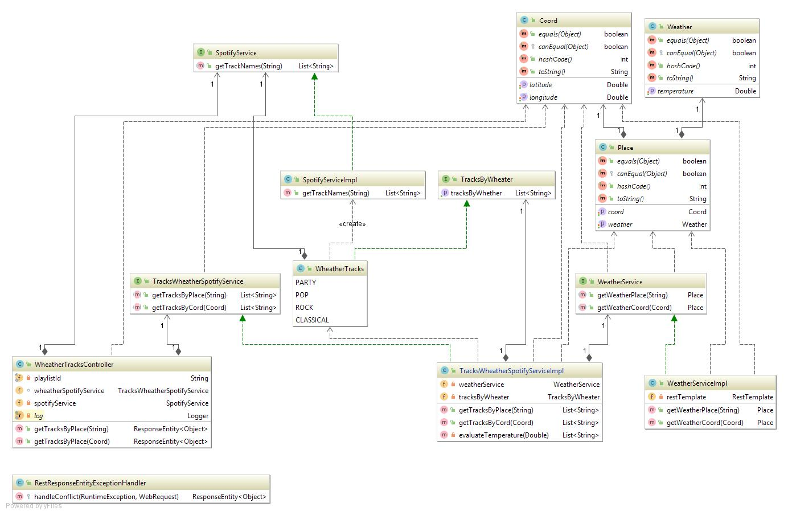

# iFood Backend Advanced Test

Create a micro-service able to accept RESTful requests receiving as parameter either city name or lat long coordinates and returns a playlist (only track names is fine) suggestion according to the current temperature.

## Business rules

* If temperature (celcius) is above 30 degrees, suggest tracks for party
* In case temperature is between 15 and 30 degrees, suggest pop music tracks
* If it's a bit chilly (between 10 and 14 degrees), suggest rock music tracks
* Otherwise, if it's freezing outside, suggests classical music tracks 

## Hints

You can make usage of OpenWeatherMaps API (https://openweathermap.org) to fetch temperature data and Spotify (https://developer.spotify.com) to suggest the tracks as part of the playlist.

## Non functional requirements

As this service will be a worldwide success, it must be prepared to be fault tolerant, responsive and resilient.

Use whatever language, tools and frameworks you feel comfortable to, and briefly elaborate on your solution, architecture details, choice of patterns and frameworks.

Also, make it easy to deploy/run your service(s) locally (consider using some container/vm solution for this). Once done, share your code with us.

________________________________________________________________________________________________________________________


# Solution
The work tools that were used are the following:


* spring-boot: Development framework used to do dependency injection.
* spring-mvc: The Spring Web MVC framework provides Model-View-Controller (MVC) architecture and ready components that can be used to develop flexible and loosely coupled web applications.
* spotify-web-api-java: Used to manage Spotify microservices
* springfox-swagger2: It is used to test the services Rest of the application.
* lombok: Utilities library to make POJO'S among other things


The class diagram used to resolve the problem is shown below.



### Start the application

First you must compile the project with Maven as follows:

```
mvn clean install
```

Once compiled the application will generate the file **test-0.0.1-SNAPSHOT.jar** and to run the application is done the 
following form, will run on the port 8080:

```
java -jar test-0.0.1-SNAPSHOT.jar
```


### The API contains two Get-type Rest Services


* The first API is to put any place you want and with respect to the place will suggest with respect to the temperature a 
playlist of music.
>http://localhost:8080/api/tracks/place

    Can be invoked as shown:

>Example:

>curl -X POST --header "Content-Type: application/json" --header "Accept: */*" -d "Polanco" "http://localhost:8080/api/tracks/place"


    The answer will be as follows:

>[
   "Deberías Estar Aquí",
   "Te Esperé",
   "Si Tú Te Vas",
   "Te Confieso",
   "Baby Girl (feat. Lalo Ebratt)",
   "Ráptame",
   "La solución (feat. Carlos Rivera)",
   "Contigo Siempre",
   "Te Equivocaste (Primera Fila) - En Vivo",
   "Dime (feat. Reik)"
 >]


* The second is to put the any coordinates of the place you want and with respect to the place will suggest with respect 
to the temperature a playlist of music.

>http://localhost:8080/api/tracks/coord

    Can be invoked as shown:

>Example:
>curl -X POST --header "Content-Type: application/json" --header "Accept: */*" -d "Polanco" "http://localhost:8080/api/tracks/place"

    The answer will be as follows:
    
>[
  "Deberías Estar Aquí",
  "Te Esperé",
  "Si Tú Te Vas",
  "Te Confieso",
  "Baby Girl (feat. Lalo Ebratt)",
  "Ráptame",
  "La solución (feat. Carlos Rivera)",
  "Contigo Siempre",
  "Te Equivocaste (Primera Fila) - En Vivo",
  "Dime (feat. Reik)"
>]

